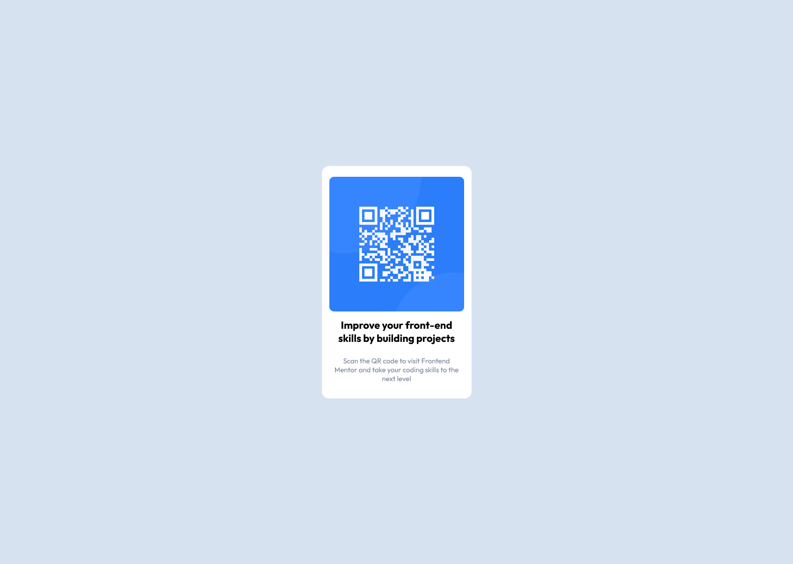

# Frontend Mentor - QR code component solution

This is a solution to the [QR code component challenge on Frontend Mentor](https://www.frontendmentor.io/challenges/qr-code-component-iux_sIO_H). Frontend Mentor challenges help you improve your coding skills by building realistic projects. 

## Table of contents

- [Overview](#overview)
  - [Screenshot](#screenshot)
  - [Links](#links)
- [My process](#my-process)
  - [Built with](#built-with)
  - [What I learned](#what-i-learned)
  - [Continued development](#continued-development)
  - [Useful resources](#useful-resources)
- [Author](#author)
- [Acknowledgments](#acknowledgments)


## Overview

### Screenshot




### Links

- Solution URL: [(https://www.frontendmentor.io/solutions/qr-code-component-using-html-and-css-x5LRRhqmyZ)]
- Live Site URL: [(https://resplendent-sundae-53016c.netlify.app/)]

## My process

### Built with

- Semantic HTML5 markup
- CSS
- Flexbox

### What I learned

I am learning essential CSS concepts from Scrimba's site so I decided to use what I learned.Specifically, the use of main, section, and footer helped arrange the HTML in a way that the CSS felt easier to write. Personally, centering a div within a div was hard for me versus using the Semantic HTML5 markup.

```html
    <section>
      <div class="qr-card">
        
        
        <h1>Improve your front-end skills by building projects</h1>
        
        <h2>Scan the QR code to visit Frontend Mentor and take your coding skills to the next level</h2>
      </div>
    </section>
```
```css
    body {
      background-color: hsl(212, 45%, 89%);   
      height: 98vh;
      }
    main {
      display: flex; 
      flex-direction: column; 
      height: 100%;
      }
    section {
      margin: auto;
      }
```

### Continued development

My journey with flexbox started rough. This exercise allowed me to use it and I felt more confident in it, although I still needed to look at resources.

### Useful resources

- [CSS Tricks](https://css-tricks.com/snippets/css/a-guide-to-flexbox/) - This guide has always been my go to for flexbox.


## Author

- Frontend Mentor - [@Jose-source](https://www.frontendmentor.io/profile/Jose-source)
- Twitter - [@stackedalex](https://twitter.com/stackedalex)


## Acknowledgments

The whole community has been inspiring and finally pushed me to do this first challenge. Here is to completing more challenges in the near future.
